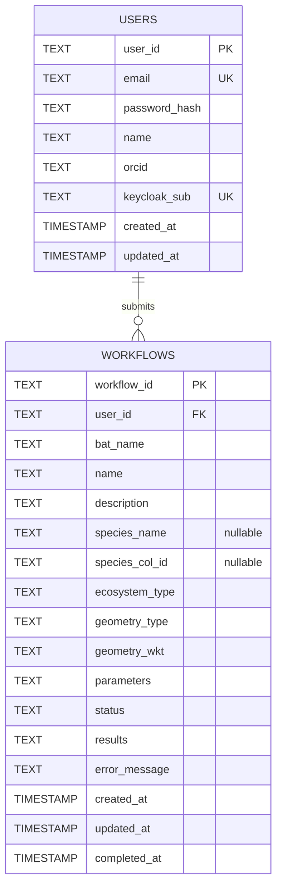

# 🌿 BMD - BATs User Platform


A modern web application for Biodiversity Analysis Tools, built with NiceGUI
and FastAPI.

- ⛓️‍💥 Live version: [https://bats.bmd-project.eu/login](http://bats.bmd-project.eu/login)
- 📓 API Documentation: [https://bats.bmd-project.eu/docs](http://bats.bmd-project.eu/docs)


<br>
<br>

## Developer documentation

Please refer to the following documents:

- [BATs Onboarding Guide](doc/bat_onboarding_guide.md): for an overall overview
  of how the BMD BATs are implemented.
- [bat-nicegui developer guide](doc/dev_guide.md): for details on how to
  contribute to this project.
- [Adding a new BAT guide](/doc/new_bat_guide.md): for details on how to add
  a new BAT to the project.

<br>
<br>

## Application Features and tech stack

- **User Authentication**: Single sign-on via Keycloak (OpenID Connect), with
  a local JWT session and SQLite backend
- **Interactive Map**: draw bounding boxes and polygons on a Europe-restricted
  Leaflet map.
- **Workflow Submission**: submit analysis workflows with configurable
  parameters.
- **Workflow Tracking**: view all submitted workflows and their status.
- **Ecosystem Types**: tag workflows by ecosystem (terrestrial/freshwater).
- **RO-Crate Submission**: generate `workflow.yaml` and `rocrate.json` from
  templates and upload them as a ZIP.
- **Webhook Integration**: receive results from Argo Workflow via webhooks.
- **Themed UI**: beautiful green-to-teal gradient theme matching the BMD brand.

### Tech Stack

- **Frontend**: NiceGUI with Tailwind CSS
- **Backend**: FastAPI (Python)
- **Database**: SQLite
- **Authentication**: Keycloak (OpenID Connect) with a local JWT session token
- **Map**: Leaflet.js with Leaflet.Draw plugin
- **Container**: Docker

### Request Flow Diagram

```txt
Browser (NiceGUI UI)
  | 1) GET /api/auth/login -> Keycloak -> GET /api/auth/callback
  v
bmd-bat-app (FastAPI + NiceGUI)
  | 2) POST /api/workflows/submit
  |    - builds RO-Crate ZIP
  |    - forwards to workflow API
  v
workflow-api (external service)
  | 3) POST /api/workflows/webhook/{workflow_id} (webhook callback)
  v
bmd-bat-app (updates SQLite, UI refresh)
```

<br>
<br>

## Quick Start

### Using Docker Compose (Recommended)

```bash
# Clone the repository
git clone <repository-url>
cd bat-nicegui

# Copy environment configuration
cp .env.example .env

# Edit .env and set a secure SECRET_KEY
nano .env

# Build and run detached
docker compose up -d --build

# Access the application at http://localhost
```

### Production with Traefik and HTTPS

Point a DNS `A` record for your production domain to the server before
starting the stack. The domain must not be an IP address because Let's Encrypt
does not issue certificates for IP addresses.

Set these values in `.env`:

```dotenv
DOMAIN=bmd.example.org
ACME_EMAIL=admin@example.org
```

The production overlay terminates TLS at Traefik, redirects HTTP to HTTPS,
and keeps the BMD container off the host network. It also sets the public URL
used for Keycloak redirects to `https://${DOMAIN}`.

Initialize the certificate storage and start the production stack:

```bash
mkdir -p letsencrypt
touch letsencrypt/acme.json
chmod 600 letsencrypt/acme.json
docker compose -f docker-compose.yml -f docker-compose.prod.yml up -d --build
```

Use these Keycloak client URLs for the production domain:

```text
https://<your-domain>/api/auth/callback
https://<your-domain>/login
```

### Local installation

Please see project's [developer guide](doc/dev_guide.md#local-deployment).

### Configuration environment variables

| Variable | Description | Default |
| -------- | ----------- | ------- |
| `SECRET_KEY` | JWT signing key (CHANGE IN PRODUCTION) | `bmd-secret-key-...` |
| `DATABASE_PATH` | SQLite database file path | `/app/data/bmd.db` |
| `LOCAL_API_BASE_URL` | Public base URL for this app, used by auth redirects | `http://localhost:8080` |
| `WORKFLOW_API_URL` | External workflow submission endpoint | `http://workflow-api:8002/api/v1/workflows` |
| `WORKFLOW_API_KEY` | API key for workflow API | configured in Compose |
| `WORKFLOW_API_AUTH_HEADER` | Header used for workflow API authentication | `Api-Key` in Compose, `Authorization` in Python default |
| `WORKFLOW_API_AUTH_SCHEME` | Optional auth scheme prefix, e.g. `Bearer` | empty in Compose, `Bearer` in Python default |
| `WORKFLOW_WEBHOOK_URL_TEMPLATE` | Webhook URL template (supports `{workflow_id}`) | `http://bmd-bat-app:8080/api/workflows/webhook/{workflow_id}` |
| `WORKFLOW_DRY_RUN` | Validate only (true/false) | `false` |
| `WORKFLOW_FORCE` | Force re-execution (true/false) | `false` |
| `KEYCLOAK_SERVER_URL` | Base URL of the Keycloak instance | (empty) |
| `KEYCLOAK_REALM` | Keycloak realm name | (empty) |
| `KEYCLOAK_CLIENT_ID` | Keycloak confidential client ID | (empty) |
| `KEYCLOAK_CLIENT_SECRET` | Keycloak client secret | (empty) |

<br>
<br>

## API Endpoints

### Authentication

| Method | Endpoint           | Description             |
| ------ | ------------------ | ----------------------- |
| POST   | `/api/auth/signup` | Create new user account |
| POST   | `/api/auth/login`  | Login and get JWT token |

Login is delegated to Keycloak via OpenID Connect (Authorization Code flow).
After a successful Keycloak login, the app still mints its own local session
JWT, used by the endpoints below and by the workflow UI.

| Method | Endpoint             | Description                                                                                         |
| ------ | -------------------- | --------------------------------------------------------------------------------------------------- |
| GET    | `/api/auth/login`    | Redirects to Keycloak's login page                                                                  |
| GET    | `/api/auth/callback` | Keycloak redirect target; exchanges the code, creates/matches local users, issues local session JWT |
| GET    | `/api/auth/logout`   | Clears the local session and ends the Keycloak SSO session                                          |

Your Keycloak realm needs a confidential client with the Authorization Code
flow enabled, a redirect URI of `<LOCAL_API_BASE_URL>/api/auth/callback`, and
a post-logout redirect URI of `<LOCAL_API_BASE_URL>/login`.

### Workflows

| Method | Endpoint                               | Description                              |
| ------ | -------------------------------------- | ---------------------------------------- |
| POST   | `/api/workflows/submit`                | Submit new analysis workflow             |
| GET    | `/api/workflows`                       | Get all workflows for authenticated user |
| POST   | `/api/workflows/webhook/{workflow_id}` | Webhook for workflow completion          |

### Workflow Webhook Payload

When your Argo Workflow completes, call the webhook with:

```json
POST /api/workflows/webhook/{workflow_id}
{
  "workflow_id": "uuid-string",
  "status": "completed",  // or "failed"
  "results": {
    "species_count": 42,
    "observation_count": 1337,
    "biodiversity_index": 0.78
  },
  "error_message": null  // or error string if failed
}
```

<br>
<br>

## SQLite Database Schema

The application stores users and submitted workflows in SQLite. Each workflow
belongs to one user through `workflows.user_id`.



`species_name` is nullable because not every BAT requires a species.
`species_col_id` stores the Catalogue of Life identifier sent to the external
SDM workflow and is also nullable for BATs without species input. The
`parameters`, `results`, and `error_message` fields store serialized workflow
data and execution output.

<br>
<br>

## External Workflow Submission

On submission, the backend uses the submitted `bat_name` to resolve the BAT's
registered template paths under `app/templates`. For example:

- `app/templates/terrestrial-sdm/workflow.yaml`
- `app/templates/terrestrial-sdm/ro-crate-metadata.json`

The selected workflow and RO-Crate metadata files are zipped into an RO-Crate
and POSTed to `WORKFLOW_API_URL`. Template paths are server-side registry
configuration; they are never accepted from the browser. A BAT without
configured templates cannot be submitted.
The external API returns the `workflow_id`, which is stored in the local
database. Webhook delivery uses `WORKFLOW_WEBHOOK_URL_TEMPLATE` (supports
`{workflow_id}`).

<br>
<br>

## Security Notes

⚠️ **For Production Deployment:**

1. Change the `SECRET_KEY` to a secure random string
2. Use HTTPS (configure nginx reverse proxy)
3. Set up proper CORS if needed
4. Consider using PostgreSQL instead of SQLite for scalability
5. Add rate limiting for API endpoints
6. Enable proper logging and monitoring

<br>
<br>

--------------------------------------------------------------------------------

Built with 💚 for biodiversity research
