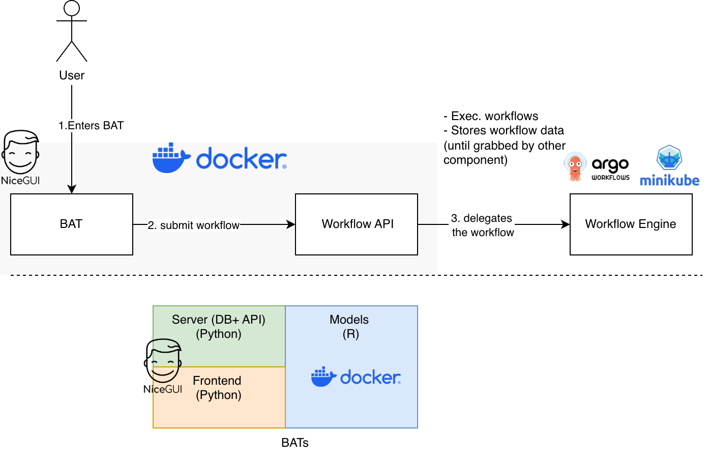

# 🌿 BMD - BATs User Platform


A modern web application for Biodiversity Analysis Tools, built with NiceGUI
and FastAPI.

- ⛓️‍💥 Live version: [http://bats.bmd-project.eu/login](http://bats.bmd-project.eu/login)
- 📓 API Documentation: [http://bats.bmd-project.eu/docs](http://bats.bmd-project.eu/docs)



<br>

## Application Features

- **User Authentication**: Single sign-on via Keycloak (OpenID Connect), with
  a local JWT session and SQLite backend
- **Interactive Map**: draw bounding boxes and polygons on a Europe-restricted
  Leaflet map.
- **Workflow Submission**: submit analysis workflows with configurable
  parameters.
- **Workflow Tracking**: view all submitted workflows and their status.
- **Ecosystem Types**: tag workflows by ecosystem (terrestrial/freshwater).
- **RO-Crate Submission**: generate `workflow.yaml` and `rocrate.json` from
  templates and upload them as a ZIP.
- **Webhook Integration**: receive results from Argo Workflow via webhooks.
- **Themed UI**: beautiful green-to-teal gradient theme matching the BMD brand.

<br>

## Tech Stack

- **Frontend**: NiceGUI with Tailwind CSS
- **Backend**: FastAPI (Python)
- **Database**: SQLite
- **Authentication**: Keycloak (OpenID Connect) with a local JWT session token
- **Map**: Leaflet.js with Leaflet.Draw plugin
- **Container**: Docker

## Request Flow Diagram

```txt
Browser (NiceGUI UI)
  | 1) GET /api/auth/login -> Keycloak -> GET /api/auth/callback
  v
bmd-bat-app (FastAPI + NiceGUI)
  | 2) POST /api/workflows/submit
  |    - builds RO-Crate ZIP
  |    - forwards to workflow API
  v
workflow-api (external service)
  | 3) POST /api/workflows/webhook/{workflow_id} (webhook callback)
  v
bmd-bat-app (updates SQLite, UI refresh)
```

<br>

## Quick Start

### Using Docker Compose (Recommended)

```bash
# Clone the repository
git clone <repository-url>
cd bat-nicegui

# Copy environment configuration
cp .env.example .env

# Edit .env and set a secure SECRET_KEY
nano .env

# Build and run detached
docker compose up -d --build

# Access the application at http://localhost
```

### Local installation

The application can be run with the following commands, and becomes
available locally on [localhost:8000](http://localhost:8000).

```sh
# Install dependencies - also creates a .venv automatically if needed.
uv sync

# Start the application - available on http://localhost:8000
export DATABASE_PATH="./data/bmd.db"
uv run -- uvicorn main:fastapi_app --reload --app-dir app
```

**Note:** the above commands assume you have [uv](https://docs.astral.sh/uv)
installed on your local machine.

### Configuration environment variables

| Variable | Description | Default |
| -------- | ----------- | ------- |
| `SECRET_KEY` | JWT signing key (CHANGE IN PRODUCTION) | `bmd-secret-key-...` |
| `DATABASE_PATH` | SQLite database file path | `/app/data/bmd.db` |
| `LOCAL_API_BASE_URL` | Public base URL for this app, used by auth redirects | `http://localhost:8080` |
| `WORKFLOW_API_URL` | External workflow submission endpoint | `http://workflow-api:8002/api/v1/workflows` |
| `WORKFLOW_API_KEY` | API key for workflow API | configured in Compose |
| `WORKFLOW_API_AUTH_HEADER` | Header used for workflow API authentication | `Api-Key` in Compose, `Authorization` in Python default |
| `WORKFLOW_API_AUTH_SCHEME` | Optional auth scheme prefix, e.g. `Bearer` | empty in Compose, `Bearer` in Python default |
| `WORKFLOW_WEBHOOK_URL_TEMPLATE` | Webhook URL template (supports `{workflow_id}`) | `http://bmd-bat-app:8080/api/workflows/webhook/{workflow_id}` |
| `WORKFLOW_DRY_RUN` | Validate only (true/false) | `false` |
| `WORKFLOW_FORCE` | Force re-execution (true/false) | `false` |
| `KEYCLOAK_SERVER_URL` | Base URL of the Keycloak instance | (empty) |
| `KEYCLOAK_REALM` | Keycloak realm name | (empty) |
| `KEYCLOAK_CLIENT_ID` | Keycloak confidential client ID | (empty) |
| `KEYCLOAK_CLIENT_SECRET` | Keycloak client secret | (empty) |

<br>

## API Endpoints

### Authentication

| Method | Endpoint           | Description             |
| ------ | ------------------ | ----------------------- |
| POST   | `/api/auth/signup` | Create new user account |
| POST   | `/api/auth/login`  | Login and get JWT token |

Login is delegated to Keycloak via OpenID Connect (Authorization Code flow).
After a successful Keycloak login, the app still mints its own local session
JWT, used by the endpoints below and by the workflow UI.

| Method | Endpoint             | Description                                                |
| ------ | -------------------- | ---------------------------------------------------------- |
| GET    | `/api/auth/login`    | Redirects to Keycloak's login page                         |
| GET    | `/api/auth/callback` | Keycloak redirect target; exchanges the code, creates/matches the local user, issues the local session JWT |
| GET    | `/api/auth/logout`   | Clears the local session and ends the Keycloak SSO session |

Your Keycloak realm needs a confidential client with the Authorization Code
flow enabled, a redirect URI of `<LOCAL_API_BASE_URL>/api/auth/callback`, and
a post-logout redirect URI of `<LOCAL_API_BASE_URL>/login`.

### Workflows

| Method | Endpoint                               | Description                              |
|--------|----------------------------------------|------------------------------------------|
| POST   | `/api/workflows/submit`                | Submit new analysis workflow             |
| GET    | `/api/workflows`                       | Get all workflows for authenticated user |
| POST   | `/api/workflows/webhook/{workflow_id}` | Webhook for workflow completion          |

### Workflow Webhook Payload

When your Argo Workflow completes, call the webhook with:

```json
POST /api/workflows/webhook/{workflow_id}
{
  "workflow_id": "uuid-string",
  "status": "completed",  // or "failed"
  "results": {
    "species_count": 42,
    "observation_count": 1337,
    "biodiversity_index": 0.78
  },
  "error_message": null  // or error string if failed
}
```

<br>

## Database Schema

Schemas (tables) stored in the application's SQLite database.

### Users Table

| Column          | Type          | Description                                   |
| --------------- | ------------- | --------------------------------------------- |
| `user_id`       | TEXT (PK)     | UUID primary key                              |
| `email`         | TEXT (UNIQUE) | User email                                    |
| `password_hash` | TEXT          | Bcrypt hashed password                        |
| `name`          | TEXT          | User's full name                              |
| `created_at`    | TIMESTAMP     | Account creation time                         |
| `orcid`         | TEXT          | Optional ORCID identifier                     |
| `keycloak_sub`  | TEXT (UNIQUE) | Keycloak subject identifier linked to account |
| `updated_at`    | TIMESTAMP     | Last update time                              |

### Workflows Table

| Column           | Type      | Description                                                    |
| ---------------- | --------- | -------------------------------------------------------------- |
| `workflow_id`    | TEXT (PK) | UUID primary key                                               |
| `user_id`        | TEXT (FK) | Reference to users table                                       |
| `name`           | TEXT      | Workflow name                                                  |
| `description`    | TEXT      | Workflow description                                           |
| `species_name`   | TEXT      | Selected species (scientific name)                             |
| `ecosystem_type` | TEXT      | Ecosystem type (terrestrial, freshwater)                       |
| `geometry_type`  | TEXT      | rectangle or polygon                                           |
| `geometry_wkt`   | TEXT      | WKT polygon/rectangle                                          |
| `parameters`     | TEXT      | JSON object of parameters (time_period, directive_types, etc.) |
| `status`         | TEXT      | submitted, running, completed, failed                          |
| `results`        | TEXT      | JSON results (when completed)                                  |
| `error_message`  | TEXT      | Error message (when failed)                                    |
| `created_at`     | TIMESTAMP | Submission time                                                |
| `updated_at`     | TIMESTAMP | Last update time                                               |
| `completed_at`   | TIMESTAMP | Completion time                                                |

<br>

## External Workflow Submission

On submission, the backend reads:

- `app/templates/terrestrial-sdm/workflow.yaml`
- `app/templates/terrestrial-sdm/ro-crate-metadata.json`

These files are zipped into an RO-Crate and POSTed to `WORKFLOW_API_URL`.
The external API returns the `workflow_id`, which is stored in the local
database. Webhook delivery uses `WORKFLOW_WEBHOOK_URL_TEMPLATE` (supports
`{workflow_id}`).

<br>

## Project Structure

```sh
bat-nicegui/
├── app/
│   ├── main.py                # Composition root (FastAPI app + NiceGUI mount)
│   ├── api/
│   │   ├── auth.py            # /api/auth/* endpoints
│   │   └── workflows.py       # /api/workflows/* endpoints
│   ├── bats/
│   │   └── terrestrial_sdm.py # /create/terrestrial page
│   ├── pages/                 # Non-BAT application pages
│   │   ├── __init__.py        # register_ui_pages()
│   │   ├── root.py            # / page
│   │   ├── login.py           # /login page
│   │   ├── select_workflow.py # /select-workflow page
│   │   ├── account.py         # /account page
│   │   ├── workflows.py       # /workflows page
│   │   └── results.py         # /results/{id} page
│   ├── ui_common.py           # Shared UI helpers/styles/header/footer/auth check
│   ├── auth_utils.py          # JWT + password helpers
│   ├── workflow_utils.py      # RO-Crate + workflow API helper functions
│   ├── schemas.py             # Pydantic request models
│   ├── config.py              # Environment-backed settings
│   ├── database.py            # SQLite database operations
│   └── templates/
│       └── terrestrial-sdm/
│           ├── workflow.yaml           # Argo workflow template
│           └── ro-crate-metadata.json  # RO-Crate metadata template
├── static/
│   ├── logo.png               # BMD logo
│   └── eu-ias-directive.json  # EU IAS directive data
├── tests/
│   ├── conftest.py            # Puts app/ on sys.path for imports
│   └── test_registry.py       # BAT registry tests
├── Dockerfile           # Docker build instructions
├── docker-compose.yml   # Docker Compose configuration
├── pyproject.toml       # Project metadata and dependencies
├── uv.lock              # Pinned dependency versions (uv)
└── README.md            # This file
```

<br>

## Development

### Adding New Features

1. Add/extend API endpoints in `app/api/auth.py` or `app/api/workflows.py`
2. Update database schema or queries in `app/database.py`
3. Add non-create UI pages as `app/pages/<name>.py` modules
4. Add/create workflow UI pages under `app/bats/` (for terrestrial SDM use `app/bats/terrestrial_sdm.py`)

> ⚠️ Please read the
> [BATs Onboarding Guide](https://github.com/Biodiversity-Meets-Data/infrastructure-docs/blob/main/docs/BAT_onboarding_guide.md)
> before contributing new BATs to this codebase.

### Managing dependencies

Dependencies are declared in `pyproject.toml` and pinned in `uv.lock`. Use
[uv](https://docs.astral.sh/uv/) to manage them:

```bash
uv sync             # Install everything (synchronizes venv and lockfile with pyproject.toml).
uv sync --no-dev    # Install runtime dependencies only.
uv sync --upgrade   # Update venv and lockfile to the latest versions of dependencies.
```

Commit both `pyproject.toml` and `uv.lock` whenever dependencies change.

### Formatting, linting and type checking

This project uses [ruff](https://docs.astral.sh/ruff) for static checking,
and [mypy](https://mypy-lang.org) for type checking.

```bash
uv run ruff check           # Lint check.
uv run ruff format --check  # Format check only (does not reformat files).
uv run ruff format          # Format files.
uv run mypy                 # Type check.
```

### Testing

This project uses [pytest](https://docs.pytest.org). Tests live in the
top-level `tests/` directory (outside `app/`, so they stay out of strict
`mypy` checks and the deployed image). Tests run in CI on every push.

```bash
# Run the test suite.
uv run pytest
```

### Versioning

This repository uses
[`bitshifted/git-auto-semver@v2`](https://github.com/marketplace/actions/git-automatic-semantic-versioning)
in [`.github/workflows/ci-pipeline.yml`](.github/workflows/ci-pipeline.yml) to
compute semantic versions.

- Pushes to `main` compute the next semantic version, and can create
  tags/releases.
- Pull request runs compute a short commit-hash version for CI validation.

### Allowed Commit Prefixes

| Commit prefix / marker | Version bump | Example |
| ---------------------- | ------------ | ------- |
| `build:`, `chore:`, `ci:`, `docs:`, `fix:`, `perf:`, `refactor:`, `revert:`, `style:`, `test:` | Patch (`x.y.Z`) | `fix: handle empty geometry payload` |
| `feat:` | Minor (`x.Y.0`) | `feat: add account ORCID validation` |
| `BREAKING CHANGE` (in commit message body/footer) | Major (`X.0.0`) | `BREAKING CHANGE: remove legacy workflow endpoint` |

Tags are expected in `v<major>.<minor>.<patch>` format (for example, `v1.4.2`),
and this repository starts from `0.1.0` when no previous tags exist.

<br>

## Security Notes

⚠️ **For Production Deployment:**

1. Change the `SECRET_KEY` to a secure random string
2. Use HTTPS (configure nginx reverse proxy)
3. Set up proper CORS if needed
4. Consider using PostgreSQL instead of SQLite for scalability
5. Add rate limiting for API endpoints
6. Enable proper logging and monitoring

<br>

## License

EUPL v1.2 (`EUPL-1.2`) - See [LICENSE](LICENSE) file for details.

<br>

## Contributing

1. Fork the repository
2. Create a feature branch
3. Make your changes
4. Submit a pull request

---

Built with 💚 for biodiversity research
